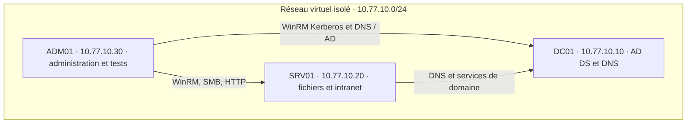
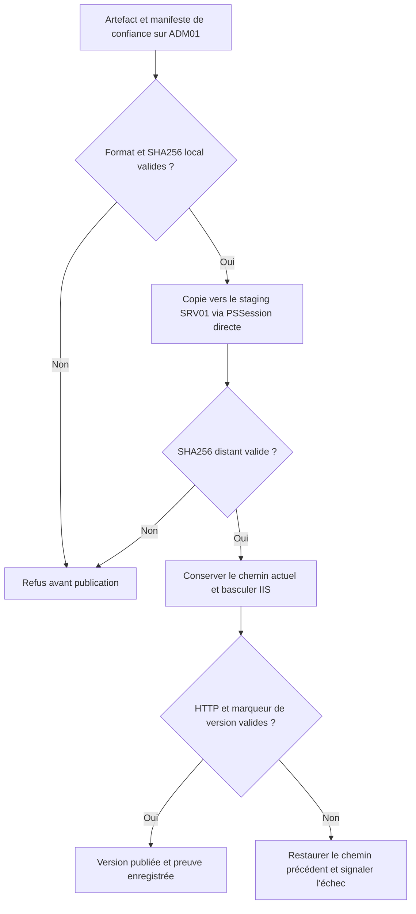

# Maquette du laboratoire — Windows Server Core

[Accueil](README.md) · [Support étudiant](etudiant/Support_TP_Etudiant.md) · [Guide formateur](formateur/Guide_Formateur.md)

## Topologie et flux principaux

Les trois VM sont en **Windows Server Core**. Domaine : `campus.test` ; NetBIOS : `CAMPUS` ; masque `/24` ; DNS des trois machines : `10.77.10.10` ; aucune passerelle. Le réseau ne possède aucun lien vers le réseau physique pendant le TP. Les flèches décrivent les flux utiles ; elles ne recensent pas tous les ports AD.

| VM | RAM fixe | vCPU | Disque dynamique | Rôle |
|---|---|---|---|---|
| DC01 | 4 Go | 2 | 60 Go | Contrôleur AD DS et DNS |
| SRV01 | 4 Go | 2 | 60 Go | Membre du domaine, SMB et IIS |
| ADM01 | 2 Go | 2 | 60 Go | Membre du domaine, orchestration et tests |

Le [JSON](commun/config/lab.json) est la référence de configuration. Les ISO et systèmes Windows ne sont pas fournis. Le serveur web et le serveur de fichiers sont regroupés pour limiter les ressources pédagogiques ; ce choix ne définit pas une architecture de production.

## Ports et contrôles

| Usage | Cible | Port | Restriction du TP |
|---|---|---|---|
| WinRM Kerberos | DC01, SRV01, ADM01 | TCP 5985 | Entrant limité à l'IP ADM01 |
| Partages métiers SMB | SRV01 | TCP 445 | Entrant limité à ADM01 ; ACL SMB et NTFS ; chiffrement SMB |
| Intranet Campus | SRV01 | TCP 8080 | Entrant limité à ADM01 ; contenu HTML statique |
| DNS du domaine | DC01 | UDP/TCP 53 | Clients du réseau du laboratoire |
| Services AD | DC01 | Plusieurs protocoles | Règles du rôle AD ; ce tableau ne suffit pas à définir un pare-feu AD complet |
| ICMP diagnostic | Les VM | ICMPv4 | Réseau du laboratoire uniquement |

## Cycle de publication et retour arrière

Les versions précédentes sont conservées. La vérification locale du site est complétée par HTTP depuis ADM01. Le rollback de chemin ne répare ni un service arrêté, ni une panne réseau, ni une migration de base de données. SHA256 détecte une différence par rapport à la référence ; il ne constitue pas une signature d'auteur.

## Permissions métiers — AGDLP

| Comptes | Groupe global métier | Groupe local de domaine ressource | Permission NTFS | Permission SMB |
|---|---|---|---|---|
| Alice et Bruno | GG_IT | DL_IT_M | Modify sur C:\LabData\IT | Change sur IT$ |
| Chloé et David | GG_RH | DL_RH_M | Modify sur C:\LabData\RH | Change sur RH$ |
| Emma et Farid | GG_Direction | DL_Direction_M | Modify sur C:\LabData\Direction | Change sur Direction$ |

L'utilisateur appartient au groupe global ; le groupe global est membre du groupe local de domaine ; les permissions sont attribuées à ce dernier. L'accès réseau résulte des deux ACL. Les comptes administratifs ne servent pas à valider l'isolation métier.

## Points de reprise

| Point | État des trois VM | Séquence suivante |
|---|---|---|
| S0-Core | OS installés, noms et réseau prêts | J1 : domaine et remoting |
| S1-Domaine | Forêt, DNS et deux membres fonctionnels | J2 : utilisateurs, groupes et accès |
| S2-Acces | AD métiers et partages vérifiés | J3 : intranet et exploitation |

Prendre les checkpoints après arrêt propre des trois VM. Restaurer un ensemble cohérent du laboratoire. Un checkpoint pédagogique n'est pas une sauvegarde de production.
