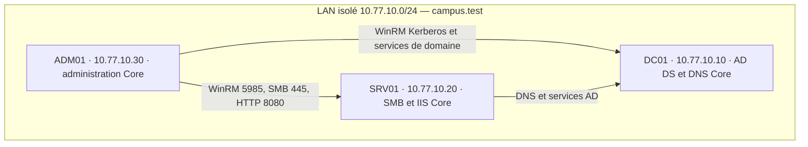

# Automatisation Déploiement / PowerShell

Support de TP complet pour un **Bachelor Réseau & Cybersécurité (Bac +3)**, sur **3 jours / 21 heures de présence** : 19 heures de travail et 2 heures de pauses.

Tous les supports pédagogiques sont en **Markdown**. Les schémas sont en **Mermaid**, directement rendus par GitHub. Les scripts PowerShell et les données d'exercice sont conservés dans leurs formats exécutables : `.ps1`, `.psm1`, `.json`, `.csv` et `.html`.

## Accès aux supports

| Public | Support |
|---|---|
| Étudiants | [Support de TP complet](etudiant/Support_TP_Etudiant.md) |
| Étudiants | [Mémo PowerShell et Server Core](etudiant/Memo_PowerShell_Core.md) |
| Tous | [Maquette, flux et déploiement — Mermaid](Maquette.md) |
| Formateur | [Guide, corrigés et conduite de séance](formateur/Guide_Formateur.md) |
| Formateur | [Recette avant cours](formateur/RECETTE-AVANT-COURS.md) |
| Formateur | [Grille d'évaluation](formateur/Grille_Evaluation.md) |
| Tous | [Sources officielles](Sources.md) |

## Parcours

| Jour | Objectifs et exercices |
|---|---|
| J1 | Objets et pipeline PowerShell, Server Core, réseau, AD DS/DNS, jointure au domaine, WinRM et inventaire distant |
| J2 | Validation CSV, provisioning AD, idempotence, modèle AGDLP, partages SMB, ACL NTFS et tests d'accès positifs/négatifs |
| J3 | IIS, publication de versions, vérification SHA256, rollback, tâche de santé, logs, incident et recette finale |

Le parcours principal comporte **10 TP**. JEA, PowerShell 7 et tests de code sont des extensions pour les binômes en avance. Le moteur du socle est **Windows PowerShell 5.1** ; Server Core désigne le mode d'installation de Windows, pas la version de PowerShell.

## Maquette



RAM : DC01 4 Go, SRV01 4 Go, ADM01 2 Go ; 2 vCPU et disque dynamique 60 Go par VM. Hôte recommandé avec 16 Go minimum, SSD et espace pour les checkpoints. DNS : 10.77.10.10 ; aucune passerelle dans le parcours hors ligne.

Voir la [maquette détaillée](Maquette.md) et le [JSON de configuration](commun/config/lab.json).

## Préparer la séance

1. Lire le [guide formateur](formateur/Guide_Formateur.md) et compléter la [recette avant cours](formateur/RECETTE-AVANT-COURS.md).
2. Obtenir l'ISO Windows Server officielle ; installer les trois OS en **Standard Core, sans Desktop Experience**, avant les 21 h. Le dépôt ne contient ni ISO Windows, ni licence, ni VHDX/OVA préinstallé.
3. Sous Hyper-V, utiliser les [scripts de préparation](commun/preparation/README.md). Pour les autres hyperviseurs, suivre le support et le guide.
4. Copier le contenu de la racine du dépôt dans `C:\Lab` sur chaque VM ; le plan réseau et les chemins des scripts supposent cette structure.
5. Démarrer J1 avec les VM au checkpoint S0-Core. Construire S1-Domaine puis S2-Acces au fil des TP.

Clonage sur le poste de préparation disposant de Git et d'Internet :

```bash
git clone https://github.com/maxime-rolland/AUTOMATISATION_POWERSHELL.git
```

Les fichiers sous `formateur/` contiennent les corrigés et sont consultables avec les droits d'accès du dépôt. Pour une distribution sans solutions, ne transmettre que `etudiant/`, `commun/`, `Maquette.md` et `Sources.md` ; conserver la même arborescence. Cette séparation est pédagogique, pas un contrôle d'accès GitHub.

## Arborescence

- [etudiant/](etudiant/README.md) : support complet, mémo et squelettes à compléter.
- [commun/](commun/README.md) : configuration, données, releases, préparation VM et modèle de compte rendu.
- [formateur/](formateur/README.md) : guide, scripts corrigés, grille et recette.
- [Maquette.md](Maquette.md) : diagrammes Mermaid et tables techniques.
- [CONTROLE.md](CONTROLE.md) : contrôles de cohérence et limites de validation.
- [manifest.json](manifest.json) : taille et SHA256 des fichiers, hors manifeste lui-même et LICENSE existante.

## État de validation

Les liens internes, données, manifestes applicatifs, horaires et encodages des scripts ont été contrôlés. La syntaxe native Windows PowerShell 5.1 et les essais Windows AD/SMB/IIS/WinRM/JEA restent à exécuter sur la maquette de salle. Le guide contient la procédure ; le dépôt ne prétend pas fournir une recette Windows déjà exécutée.

Auteur : Maxime ROLLAND · Pulse myIT. Version 1.1 — 6 octobre 2026. Licence : [MIT](LICENSE).
