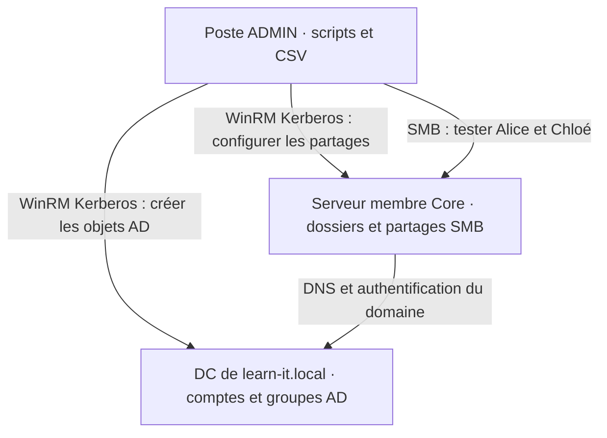

# 01 — Maquette et mise en route

[Accueil](../README.md) · [Étape suivante](02-PowerShell-et-inventaire.md)

## La mission

L'entreprise fictive du TP accueille six personnes, réparties entre IT et RH. Aujourd'hui, l'administrateur crée chaque compte et chaque dossier à la main. Il risque d'oublier une appartenance, de donner un droit trop large ou de recommencer une création déjà effectuée.

Votre travail consiste à transformer ce processus en une suite contrôlée : **lire des données, les valider, appliquer les changements nécessaires et vérifier les résultats**. L'objet étudié est cette automatisation. Le domaine existe déjà ; sa création et l'installation des OS ne font pas partie du temps d'exercice.

Dans cette première étape, vous vérifiez vos VM, vous activez leur administration à distance et vous renseignez la configuration utilisée par vos scripts. Exécutez les commandes dans l'ordre indiqué ; le nom de la machine et le type de console sont précisés avant chaque bloc.

## Machines nécessaires



| Machine | Situation avant le TP | Rôle pendant le TP |
|---|---|---|
| DC01, nom adaptable | Windows Server, de préférence Core ; DC existant de learn-it.local, DNS fonctionnel | Exécuter les commandes ActiveDirectory |
| SRV01, nom adaptable | Windows Server Core membre du domaine | Héberger les dossiers/partages du TP |
| Poste ADMIN | Windows membre du domaine, PowerShell 5.1 | Écrire, piloter et tester ; Windows 11 ou Server Core |

Vos trois VM doivent être disponibles au démarrage : Windows est installé, DC01 héberge déjà le domaine et les deux autres machines en sont membres. Si ces conditions ne sont pas remplies, terminez ces prérequis avant de commencer l'automatisation ; les commandes du TP ne créent pas le domaine.

**Conservez le plan IP et les noms de votre laboratoire.** Pour une maquette utilisant les valeurs du dépôt : DC01 10.77.10.10, SRV01 10.77.10.20, ADMIN 10.77.10.30 sur un LAN isolé /24 ; les membres utilisent DC01 comme DNS. Déclarez une passerelle par défaut, même si aucun routeur ne lui répond, par exemple 10.77.10.254 : sans passerelle, Windows classe le LAN en « Réseau non identifié » et applique le profil pare-feu Public au lieu du profil Domaine. `Get-NetConnectionProfile` doit afficher `DomainAuthenticated` sur les membres.

Vérifiez les ressources allouées à votre copie : DC 2 vCPU/4 Go/60 Go ; serveur membre 2 vCPU/4 Go/60 Go ; poste admin Core 2 vCPU/2 Go/60 Go, ou Windows 11 2 vCPU/4 Go/64 Go avec TPM 2.0 et démarrage sécurisé UEFI, ou poste déjà existant. Server Core fonctionne aussi avec 2 Go par serveur. Vous pouvez utiliser Proxmox, Hyper-V, VMware ou KVM/libvirt ; les scripts s'exécutent dans Windows et ne dépendent pas de l'hyperviseur. Pour KVM, le dossier [kvm](../kvm/README.md) construit automatiquement les trois VM, le domaine et l'instantané initial.

## Configuration : le fichier que vous devez adapter

[lab.json](../config/lab.json) contient les données qui dépendent de votre environnement.

| Clé | Exemple | Utilité |
|---|---|---|
| DomainName | learn-it.local | Garde contre une exécution dans un autre domaine |
| DomainController | dc01.learn-it.local | Destination des commandes AD |
| FileServer | srv01.learn-it.local | Destination des commandes de partages |
| AdminIPAddress | 10.77.10.30 | Adresse réelle du poste qui teste SMB |
| DataRoot | C:\TP-Automatisation\Partages | Chemin réservé aux dossiers fictifs ; garder cette valeur |
| Services | IT, RH | Services autorisés dans le CSV |

Le nom DNS `learn-it.local` ne permet pas de deviner le nom court NetBIOS. Le script le lit avec `Get-ADDomain` et le transmet au serveur de fichiers. C'est pourquoi les droits ne contiennent pas un `LEARN-IT` écrit arbitrairement dans le code.

### Une maquette identique, copiée pour chaque poste de travail

Le TP est identique pour tous : mêmes noms de VM, même domaine, même CSV et mêmes objets AD/SMB. Les noms recommandés sont DC01, SRV01 et ADMIN ; si les VM fournies portent déjà d'autres noms, seuls les FQDN et l'IP de test du JSON sont à vérifier.

Vous travaillez, seul ou à deux, sur votre **propre copie du domaine et des trois VM**, reliées à un LAN virtuel isolé des autres copies. Vérifiez à quel réseau virtuel chaque carte est connectée : les trois VM de votre copie doivent communiquer entre elles, sans rejoindre le LAN des autres maquettes. Cette isolation permet de conserver les mêmes noms et adresses partout sans collision. La création du réseau virtuel fait partie des prérequis.

Avant vos premières créations, vérifiez que vous disposez d'une sauvegarde ou d'un point de restauration cohérent des trois VM, pris dans leur état initial. Si vous devez le constituer, arrêtez proprement les trois VM, sauvegardez cet ensemble, puis redémarrez-les. Cet état initial ne contient encore ni l'OU `TP-Automatisation`, ni les comptes `tp.*`, ni les partages `TP_IT$`/`TP_RH$`.

## Contrôle de départ, sur ADMIN

```powershell
# ADMIN : identifier la machine et le compte qui exécutent les commandes locales.
hostname
whoami

# Vérifier PSVersion = 5.1 ; ouvrir powershell.exe si le moteur actuel est différent.
$PSVersionTable

# PartOfDomain doit être True et Domain doit être learn-it.local.
Get-CimInstance Win32_ComputerSystem | Select-Object Name,Domain,PartOfDomain

# Lire l'IP du poste et les serveurs DNS ; le DNS du labo doit résoudre learn-it.local.
Get-NetIPConfiguration

# Vérifier les adresses des cibles ; adapter uniquement si les VM fournies ont d'autres noms.
Resolve-DnsName dc01.learn-it.local
Resolve-DnsName srv01.learn-it.local

# Ce type SRV demande le service LDAP des DC, pas l'adresse d'un poste.
Resolve-DnsName '_ldap._tcp.dc._msdcs.learn-it.local' -Type SRV
```

Utilisez les noms réels de vos serveurs s'ils diffèrent des exemples. Vérifiez que le poste est membre du domaine et que les FQDN résolvent vers les bonnes IP. Corrigez un problème de DNS avant de passer aux connexions distantes.

## Activer l'administration à distance sur DC01 et SRV01

Ouvrez la **console de la VM DC01**, connectez-vous avec le compte d'administration du laboratoire et ouvrez Windows PowerShell avec les droits administrateur. Sur Server Core, saisissez `powershell.exe` si vous êtes dans l'invite de commandes. Exécutez le bloc suivant, puis faites la même chose dans la **console de SRV01**.

Cette opération permet ensuite au poste ADMIN d'envoyer des commandes PowerShell aux serveurs. Vous la réalisez depuis leurs consoles locales, car la connexion distante que vous préparez peut ne pas être encore disponible.

```powershell
# Sur DC01 puis SRV01, en console Windows PowerShell administrateur.
# Activer WinRM et les points d'entrée PowerShell nécessaires aux sessions distantes.
# -Force supprime les demandes de confirmation ; la commande configure aussi les règles associées.
Enable-PSRemoting -Force

# Vérifier que le service qui reçoit les connexions distantes est démarré : Status = Running.
Get-Service WinRM
```

Revenez maintenant sur **ADMIN** et testez le port utilisé :

```powershell
# ADMIN : vérifier la connectivité vers WinRM après son activation sur les deux serveurs.
# Adapter les noms uniquement si vos VM portent d'autres noms DNS.
Test-NetConnection dc01.learn-it.local -Port 5985
Test-NetConnection srv01.learn-it.local -Port 5985
```

Vous devez obtenir `TcpTestSucceeded = True` pour les deux cibles. Si l'un des tests échoue, vérifiez sur la cible le service WinRM et les règles de pare-feu associées à l'administration distante. Gardez le pare-feu actif : cherchez la règle concernée plutôt que désactiver l'ensemble de la protection.

Ce test valide le passage TCP, pas encore votre authentification. À l'étape 02, vous ouvrirez une PSSession avec votre compte administratif et **le nom DNS du serveur**. Dans ce laboratoire de domaine, Kerberos utilise ce nom pour identifier la cible ; une adresse IP ne convient pas aux appels Kerberos prévus dans le TP.

## Emplacement des fichiers et moteur

Cloner sur le poste ADMIN disposant de Git, ou copier le dossier fourni. Sur un LAN isolé sans Internet, le dépôt est souvent remis sur un DVD virtuel : copiez-le avec `robocopy D:\ C:\TP-PowerShell /E /A-:R`, en remplaçant D: par la lettre du lecteur. `/A-:R` retire l'attribut lecture seule que portent les fichiers d'un DVD ; sans lui, vous ne pourriez pas modifier le CSV.

```powershell
# ADMIN : télécharger le dépôt si Git est installé ; sinon copier le dossier fourni.
# Le dossier de destination doit être absent ou vide pour git clone.
git clone https://github.com/maxime-rolland/AUTOMATISATION_POWERSHELL.git C:\TP-PowerShell

# Toutes les commandes suivantes utilisent cette racine comme dossier courant.
Set-Location C:\TP-PowerShell

# Lire tout le JSON en une chaîne, puis le convertir en objet pour vérifier les valeurs.
Get-Content .\config\lab.json -Raw | ConvertFrom-Json

# Afficher les stratégies d'exécution et leurs portées ; cette lecture ne les change pas.
Get-ExecutionPolicy -List
```

Si les scripts locaux vérifiés sont bloqués, appliquer la règle de la salle. Windows 11 est en `Restricted` par défaut ; Windows Server est en `RemoteSigned`. Sur un poste Windows 11, `Set-ExecutionPolicy -Scope CurrentUser -ExecutionPolicy RemoteSigned` autorise les scripts locaux de votre compte, y compris dans les consoles `runas /netonly` de l'étape 04, qui fonctionnent avec ce même compte local. La portée `Process` ne vaut que pour la console courante. Une GPO peut primer. Après inspection, `Get-ChildItem .\scripts -Filter *.ps1 | Unblock-File` peut retirer le marquage Internet. Ces commandes ne remplacent pas la lecture du code.

Le moteur retenu est **Windows PowerShell 5.1 (`powershell.exe`)**. Les corrections utilisent les modules natifs Windows/AD ; elles ne nécessitent pas de téléchargement de module pendant la séance. Server Core est un mode d'installation de Windows, indépendant de la version de PowerShell. Les scripts fournis sont en UTF-8 avec BOM pour conserver les accents en 5.1.

Avant de lancer les scripts, effectuez le [contrôle syntaxique](../VALIDATION.md#contrôle-syntaxique-non-exécutant) sur ADMIN. Il lit les fichiers sans créer d'objet AD ni modifier de partage. Corrigez les erreurs éventuelles, puis poursuivez avec l'étape 02.

## Identités et périmètre

Utilisez un compte d'administration du laboratoire pour les créations AD et la configuration du serveur. Vérifiez qu'il dispose des droits nécessaires sur les deux cibles ; ces droits peuvent être délégués. Vous saisirez ce compte avec Get-Credential à l'étape 02. Pour démontrer les accès, vous utiliserez ensuite Alice et Chloé, des comptes ordinaires.

Les créations sont prévues dans l'OU `TP-Automatisation` et les dossiers dédiés. Utilisez uniquement les données fictives du dépôt. Si votre copie contient déjà les objets d'une séance précédente, retrouvez son état initial avant de commencer une nouvelle séance. En revanche, **pendant le TP**, conservez les objets créés : les étapes suivantes et les tests de relance s'appuient sur cet état.

**Vous pouvez passer à l'étape 02 lorsque :** votre copie est isolée, ADMIN est membre du domaine, les deux noms DNS sont résolus, WinRM est démarré et joignable sur les deux cibles, et le JSON décrit votre maquette. Vous vérifierez l'authentification Kerberos en ouvrant les premières sessions à l'étape suivante.
