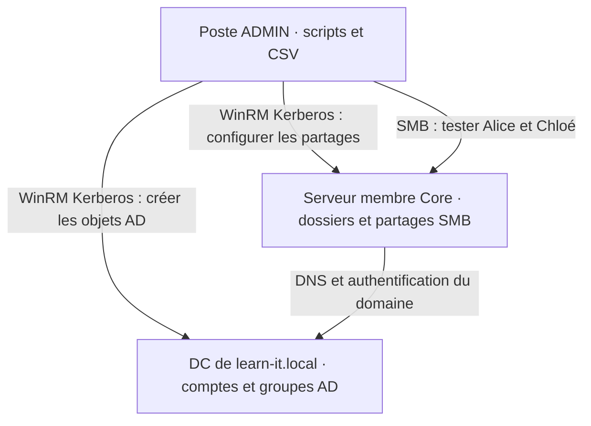

# 01 — Maquette et mise en route

[Accueil](../README.md) · [Étape suivante](02-PowerShell-et-inventaire.md)

## La mission

L'entreprise fictive du TP accueille six personnes, réparties entre IT et RH. Aujourd'hui, l'administrateur crée chaque compte et chaque dossier à la main. Il risque d'oublier une appartenance, de donner un droit trop large ou de recommencer une création déjà effectuée.

Votre travail consiste à transformer ce processus en une suite contrôlée : **lire des données, les valider, appliquer les changements nécessaires et vérifier les résultats**. L'objet étudié est cette automatisation. Le domaine existe déjà ; sa création et l'installation des OS ne font pas partie du temps d'exercice.

## Machines nécessaires



| Machine | Situation avant le TP | Rôle pendant le TP |
|---|---|---|
| DC01, nom adaptable | DC existant de learn-it.local, DNS fonctionnel | Exécuter les commandes ActiveDirectory |
| SRV01, nom adaptable | Windows Server Core membre du domaine | Héberger les dossiers/partages du TP |
| Poste ADMIN | Windows membre du domaine, PowerShell 5.1 | Écrire, piloter et tester ; Windows 11 ou Server Core |

Si le laboratoire existe, **conserver son plan IP et ses noms**. Ne pas changer l'adressage pour suivre les valeurs d'exemple. Si le formateur doit préparer une maquette neuve : DC01 10.77.10.10, SRV01 10.77.10.20, ADMIN 10.77.10.30 sur un LAN isolé /24 ; DNS des membres vers DC01. Une passerelle n'est utile que si le réseau du laboratoire en prévoit une.

Profil confortable pour une maquette entièrement virtualisée : DC 2 vCPU/4 Go/60 Go ; serveur membre 2 vCPU/4 Go/60 Go ; poste admin Core 2 vCPU/2 Go/60 Go ou poste déjà existant. Sous Proxmox, Hyper-V ou VMware, le formateur fournit le réseau et les OS déjà prêts. Aucun hyperviseur particulier n'est nécessaire à l'exécution des scripts.

## Configuration : le fichier que vous devez adapter

[lab.json](../config/lab.json) contient les données qui dépendent de votre environnement.

| Clé | Exemple | Utilité |
|---|---|---|
| DomainName | learn-it.local | Garde contre une exécution dans un autre domaine |
| DomainController | dc01.learn-it.local | Destination des commandes AD |
| FileServer | srv01.learn-it.local | Destination des commandes de partages |
| AdminIPAddress | 10.77.10.30 | Adresse réelle du poste qui teste SMB |
| DataRoot | C:\TP-Automatisation\Partages | Chemin réservé aux dossiers fictifs ; garder cette valeur |
| Services | IT, RH | Services autorisés dans le CSV |

Le nom DNS `learn-it.local` ne permet pas de deviner le nom court NetBIOS. Le script le lit avec `Get-ADDomain` et le transmet au serveur de fichiers. C'est pourquoi les droits ne contiennent pas un `LEARN-IT` écrit arbitrairement dans le code.

### Une maquette identique, copiée pour chaque poste de travail

Le TP est identique pour tous : mêmes noms de VM, même domaine, même CSV et mêmes objets AD/SMB. Les noms recommandés sont DC01, SRV01 et ADMIN ; si les VM fournies portent déjà d'autres noms, seuls les FQDN et l'IP de test du JSON sont à vérifier.

Chaque étudiant ou binôme travaille sur sa **propre copie du domaine et des VM**, reliées à un LAN virtuel isolé des autres copies. Le formateur duplique une maquette préparée avant le cours ; il ne relie pas les copies entre elles. Cela permet de conserver les mêmes noms et adresses partout sans collision. Un réseau isolé Hyper-V, un LAN interne VMware ou un réseau Proxmox séparé convient ; la préparation de l'hyperviseur reste hors des deux jours de TP.

Avant la distribution, arrêter proprement les trois VM et conserver une copie ou un point de restauration cohérent de cet état préparé. Le socle ne contient encore ni l'OU `TP-Automatisation`, ni les comptes `tp.*`, ni les partages `TP_IT$`/`TP_RH$`.

## Contrôle de départ, sur ADMIN

```powershell
# ADMIN : identifier la machine et le compte qui exécutent les commandes locales.
hostname
whoami

# Vérifier PSVersion = 5.1 ; ouvrir powershell.exe si le moteur actuel est différent.
$PSVersionTable

# PartOfDomain doit être True et Domain doit être learn-it.local.
Get-CimInstance Win32_ComputerSystem | Select-Object Name,Domain,PartOfDomain

# Lire l'IP du poste et les serveurs DNS ; le DNS du labo doit résoudre learn-it.local.
Get-NetIPConfiguration

# Vérifier les adresses des cibles ; adapter uniquement si les VM fournies ont d'autres noms.
Resolve-DnsName dc01.learn-it.local
Resolve-DnsName srv01.learn-it.local

# Ce type SRV demande le service LDAP des DC, pas l'adresse d'un poste.
Resolve-DnsName '_ldap._tcp.dc._msdcs.learn-it.local' -Type SRV

# Tester le port WinRM des deux cibles ; TcpTestSucceeded doit être True.
# Ce test prouve la connectivité TCP ; l'authentification sera testée à l'étape 02.
Test-NetConnection dc01.learn-it.local -Port 5985
Test-NetConnection srv01.learn-it.local -Port 5985
```

Remplacer les noms de serveur par ceux du JSON. Le poste doit être membre du domaine, les FQDN doivent résoudre vers les bonnes IP et WinRM doit être accessible. Un ping seul ne suffit pas : il ne valide ni WinRM, ni l'identité, ni l'accès SMB.

Sur les deux serveurs, le formateur active WinRM en console admin si nécessaire :

```powershell
# Sur DC01 puis SRV01, en console Windows PowerShell administrateur.
# Préparer WinRM, le point d'entrée PowerShell et ses règles de pare-feu.
Enable-PSRemoting -Force
```

Il vérifie les règles réseau existantes. Le TP conserve Windows Firewall et Defender actifs. Il n'utilise pas TrustedHosts `*`, Basic, AllowUnencrypted ou CredSSP. Kerberos s'utilise avec les **noms DNS**, pas avec les IP des serveurs dans les PSSession.

## Emplacement des fichiers et moteur

Cloner sur le poste ADMIN disposant de Git, ou copier le dossier téléchargé :

```powershell
# ADMIN : télécharger le dépôt si Git est installé ; sinon copier le dossier fourni.
# Le dossier de destination doit être absent ou vide pour git clone.
git clone https://github.com/maxime-rolland/AUTOMATISATION_POWERSHELL.git C:\TP-PowerShell

# Toutes les commandes suivantes utilisent cette racine comme dossier courant.
Set-Location C:\TP-PowerShell

# Lire tout le JSON en une chaîne, puis le convertir en objet pour vérifier les valeurs.
Get-Content .\config\lab.json -Raw | ConvertFrom-Json

# Afficher les stratégies d'exécution et leurs portées ; cette lecture ne les change pas.
Get-ExecutionPolicy -List
```

Si les scripts locaux vérifiés sont bloqués, appliquer la règle de la salle ; éventuellement `Set-ExecutionPolicy -Scope Process -ExecutionPolicy RemoteSigned`. Une GPO peut primer. Après inspection, `Get-ChildItem .\scripts -Filter *.ps1 | Unblock-File` peut retirer le marquage Internet. Ces commandes ne remplacent pas la lecture du code.

Le moteur retenu est **Windows PowerShell 5.1 (`powershell.exe`)**. Les corrections utilisent les modules natifs Windows/AD ; elles ne nécessitent pas de téléchargement de module pendant la séance. Server Core est un mode d'installation de Windows, indépendant de la version de PowerShell. Les scripts fournis sont en UTF-8 avec BOM pour conserver les accents en 5.1.

## Identités et périmètre

Un compte d'administration de laboratoire exécute les créations AD et la configuration du serveur. Il lui faut les droits correspondants sur les deux cibles. Ces droits peuvent être délégués ; le corrigé ne crée aucun administrateur de domaine. Pour la démonstration des accès, on utilise ensuite Alice et Chloé, des comptes ordinaires.

Les créations sont prévues dans l'OU `TP-Automatisation` et les dossiers dédiés. Ne pas utiliser de données réelles. Avant la première création, le formateur remet la copie du laboratoire à son état préparé si une séance précédente a déjà utilisé ces noms. Il n'y a pas de script de suppression globale du domaine.

**Porte de sortie :** les deux serveurs répondent en WinRM Kerberos, le fichier de configuration décrit votre copie isolée de la maquette. Vous pouvez commencer l'automatisation.
