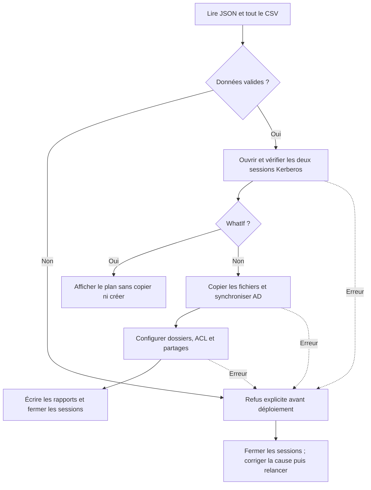

# 05 — Une commande pour tout déployer, puis démontrer le résultat

[Accueil](../README.md) · [Partages](04-Partages-et-tests.md) · [Évaluation](../EVALUATION.md)

**Correction : [04-Deploy-Lab.ps1](../scripts/04-Deploy-Lab.ps1).**

## L'automatisation complète

Les étapes précédentes vous ont fait copier et lancer les scripts pour comprendre leur contexte. Maintenant, le poste ADMIN doit effectuer ces opérations avec une seule commande. C'est le rôle du pilote : il ne réécrit pas toute la logique AD et ACL ; il coordonne les scripts spécialisés.



Une erreur peut laisser des objets déjà créés si elle survient pendant la synchronisation. Le pilote n'efface pas tout pour revenir à zéro ; il explique l'échec et permet une reprise additive. La validation du CSV et des deux connexions se fait avant les premières modifications de déploiement.

## Lire la correction par responsabilités

| Responsabilité | Code à repérer | Pourquoi |
|---|---|---|
| Paramétrer | ConfigPath, CsvPath, ResultPath, Credential | Réutiliser le pilote et changer son jeu d'entrée |
| Vérifier | Read-LabConfig, Read-ValidatedUsers | Ne pas copier/déployer des données incorrectes |
| S'authentifier | New-PSSession, Kerberos | Utiliser la bonne identité et les noms DNS |
| Confirmer le contexte | Get-ADDomain, Win32_ComputerSystem | Vérifier le domaine et le rôle du serveur de fichiers |
| Planifier | WhatIfPreference et ShouldProcess | Décrire l'opération sans l'effectuer |
| Distribuer | Copy-Item -ToSession | Copier directement depuis ADMIN vers la cible |
| Ordonnancer | AD avant partages | Les groupes doivent exister avant la résolution de SID |
| Transmettre | ArgumentList et param | Passer chemins, secret sécurisé et NetBIOS comme objets |
| Rendre compte | comptes.csv, partages.csv, deploiement.json | Montrer créations, conservation et horodatage |
| Libérer | finally puis Remove-PSSession | Fermer les connexions après succès ou échec |

Le secret temporaire n'est pas écrit dans les rapports. Une fois la session établie, WinRM Kerberos protège les échanges de messages. Le fichier CSV et les scripts sont poussés par ADMIN vers la cible. Le serveur n'essaie pas d'aller lire un partage sur une troisième machine avec votre identité : cela évite le problème de second saut.

## Premier lancement

```powershell
Set-Location C:\TP-PowerShell
$admin = Get-Credential -Message 'Administration de la maquette'
.\scripts\04-Deploy-Lab.ps1 -Credential $admin -WhatIf
$password = Read-Host 'Secret temporaire des comptes fictifs' -AsSecureString
.\scripts\04-Deploy-Lab.ps1 -Credential $admin -InitialPassword $password
Get-Content .\resultats\deploiement.json -Raw | ConvertFrom-Json
Import-Csv .\resultats\comptes.csv -Delimiter ';' -Encoding UTF8
Import-Csv .\resultats\partages.csv -Delimiter ';' -Encoding UTF8
```

Sur une maquette neuve B01, le résumé annonce Created=6, Existing=0, Shares=2. Si vous avez déjà fait l'étape AD séparément, il doit annoncer Created=0 et Existing=6 ; ce n'est pas une erreur. La vérité est l'état présent, pas un chiffre de démonstration obtenu en supprimant manuellement des comptes.

State=OK signifie que les étapes administratives du pilote sont terminées. Il reste à vérifier l'accès SMB avec les identités métiers : le pilote tourne en administrateur et ne peut donc pas conclure seul à l'isolation d'Alice.

## Second lancement et preuve d'idempotence

```powershell
Copy-Item .\resultats\comptes.csv .\resultats\comptes-avant-relance.csv
.\scripts\04-Deploy-Lab.ps1 -Credential $admin -InitialPassword $password
Get-Content .\resultats\deploiement.json -Raw | ConvertFrom-Json
```

Attendu : zéro nouveau compte ; les mêmes groupes et partages ; mêmes accès autorisés/refusés. Les ACL sont réappliquées, ce qui est une opération technique répétée, mais les ressources métier ne se multiplient pas. Le script ne réinitialise pas les mots de passe des comptes existants.

Comparer les vrais objets AD, les listes de partages et les résultats métiers. Un script qui affiche EXISTANT mais modifie indûment les droits n'est pas correctement vérifié par son seul rapport.

## Test d'entrée invalide

Noter le nombre d'utilisateurs de votre OU, lancer avec le CSV invalide, puis recompter :

```powershell
.\scripts\04-Deploy-Lab.ps1 -Credential $admin `
    -CsvPath .\donnees\utilisateurs-invalides.csv -InitialPassword $password
```

L'erreur apparaît avant le déploiement. Aucun nouvel utilisateur, groupe ou partage ne doit être ajouté. L'ancien rapport d'un passage réussi peut toujours être présent : **ne pas confondre un ancien State=OK avec le résultat de l'appel qui vient d'échouer**. Lire l'erreur réelle et les compteurs avant/après.

## Test d'une cible inaccessible

Créer une copie du JSON dans `config/lab-erreur.json` et y remplacer FileServer par `absent.learn-it.local`. Lancer le pilote avec `-ConfigPath` vers cette copie. Il doit produire une erreur explicite et fermer toute session déjà ouverte. Le vrai JSON n'est pas altéré.

```powershell
Copy-Item .\config\lab.json .\config\lab-erreur.json
$bad = Get-Content .\config\lab-erreur.json -Raw | ConvertFrom-Json
$bad.FileServer = 'absent.learn-it.local'
$bad | ConvertTo-Json | Set-Content .\config\lab-erreur.json -Encoding UTF8
.\scripts\04-Deploy-Lab.ps1 -Credential $admin `
    -ConfigPath .\config\lab-erreur.json -InitialPassword $password
```

Le pilote précontrôle les deux sessions avant de déployer ; cette panne doit donc empêcher le début des créations. Pour reprendre, revenir au vrai JSON. Il n'est pas nécessaire de désactiver le pare-feu, de promouvoir un nouveau domaine ou de supprimer l'OU.

## Adaptation courte, niveau Bac +3

Le formateur choisit **une** modification : ajouter une septième personne IT, changer le chemin des rapports, enrichir l'inventaire d'une propriété, ou expliquer et modifier un contrôle de validation. Vous avez accès aux corrigés et à l'IA ; vous devez montrer la modification et la preuve de son effet.

Si le groupe est en avance, ajouter COM dans config.Services et une personne COM dans le CSV. Le même algorithme doit construire les groupes et un troisième partage. Cette extension n'est pas nécessaire pour la note maximale du socle ; elle démontre l'intérêt d'un traitement piloté par les données.

## Démonstration devant l'enseignant : 8 à 10 min

1. **Contexte, 1 min :** montrer votre LabId, les noms des serveurs et le domaine learn-it.local.
2. **Déploiement, 2 min :** lancer le pilote ; lire le rapport récent ; montrer les comptes/groupes et les deux partages. Si tout est déjà présent, conserver cet état et expliquer Existing.
3. **Relance, 1 min :** rejouer et montrer zéro nouveau compte, puis vérifier le résultat présent.
4. **Droits, 2 min :** Alice IT oui/RH non ; Chloé RH oui/IT non, dans leurs consoles réseau séparées.
5. **Erreur et adaptation, 2 min :** CSV invalide refusé sans ajout, ou cible inaccessible selon le choix de l'enseignant ; montrer une petite modification utile.
6. **Explication individuelle, 1 à 2 min :** chaque membre explique une partie choisie du script et la cause d'un résultat.

Une maquette qui démarre mais dont les droits n'ont jamais été testés n'est pas une démonstration complète. Les scripts peuvent être ceux de la correction : vous devez comprendre leur rôle et leurs limites.

## Remise minimale

- Scripts utilisés et fichiers JSON/CSV de votre binôme, sans secret.
- Résultats de déploiement/inventaire et quelques extraits d'erreur.
- Un [bilan court](../BILAN.md) : état final, tests, une erreur résolue, usage de l'IA et limite identifiée.

Le cœur de l'évaluation est le **fonctionnement en direct**. Le bilan aide à garder une trace ; il ne remplace pas la maquette.
