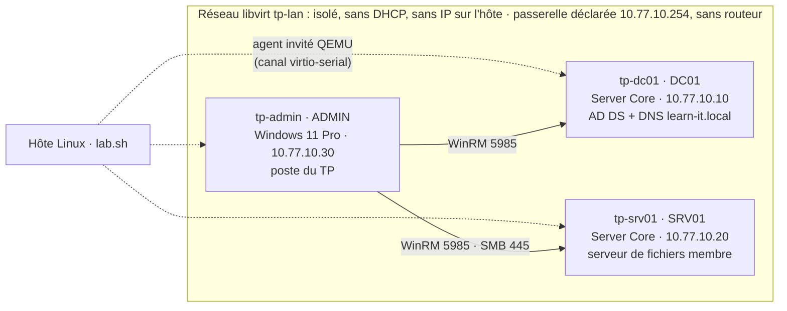

# Maquette du TP sous KVM / libvirt

[Accueil](../README.md) · [01 — Maquette et mise en route](../docs/01-Maquette-et-demarrage.md)

**Public : l'enseignant ou le responsable de la salle.** Ce dossier construit, sur un poste Linux, la maquette dont le TP a besoin : `DC01`, `SRV01` et `ADMIN` dans le domaine `learn-it.local`, sur un LAN virtuel isolé. Les étudiants commencent ensuite à l'[étape 01](../docs/01-Maquette-et-demarrage.md) ; la création du domaine n'est pas un exercice.

`lab.sh` installe Windows sans surveillance, crée le domaine, joint les membres, vérifie les prérequis et prend l'instantané `etat-initial` des trois VM. Le même outil remet la maquette à zéro entre deux séances et peut jouer le corrigé complet pour la valider.

## Ce que l'on obtient



| VM libvirt | Windows | Système | vCPU / RAM / disque | Particularités |
|---|---|---|---|---|
| tp-dc01 | DC01 | Windows Server Core (2022 ou 2025) | 2 / 2 Gio / 60 Go | Forêt `learn-it.local`, NetBIOS `LEARN-IT`, DNS |
| tp-srv01 | SRV01 | Windows Server Core | 2 / 2 Gio / 60 Go | Membre du domaine, accueillera les partages du TP |
| tp-admin | ADMIN | Windows 11 Pro | 2 / 4 Gio / 64 Go | Membre du domaine, TPM 2.0 émulé, Secure Boot |

Les disques sont des fichiers qcow2 alloués à la demande : la maquette occupe environ 30 Go après installation (ADMIN 17 Go, chaque serveur 6 Go). La RAM indiquée suffit pour Server Core ; elle se règle avec `DC_RAM`, `SRV_RAM` et `ADMIN_RAM` (en Mio).

Comptes de la maquette :

| Compte | Usage |
|---|---|
| `LEARN-IT\Administrator` (`Administrator@learn-it.local`) | Administrateur du domaine : ouverture de session sur les trois VM et `Get-Credential` du TP |
| `ADMIN\labadmin` | Compte local de construction du poste Windows 11 ; inutile pendant le TP |

Les deux comptes utilisent le secret fourni dans `LAB_PASSWORD` lors de la construction. Le serveur d'évaluation étant en anglais, le compte s'appelle `Administrator`, et non `Administrateur`.

## Choix techniques

| Choix | Raison |
|---|---|
| Réseau libvirt **sans `<ip>` ni `<forward>`** | Pont purement isolé : ni NAT, ni DHCP, ni adresse de l'hôte. Les VM ne voient qu'elles-mêmes, comme le demande l'étape 01. DC01 fournit le DNS. |
| Passerelle **10.77.10.254 déclarée, sans routeur** | Sans passerelle, Windows classe le LAN en « Réseau non identifié », donc en profil pare-feu Public. Avec elle, les membres passent en `DomainAuthenticated`. Rien ne sort du LAN. |
| `AlwaysExpectDomainController` sur DC01 | Un DC démarre avant ses propres services AD : NLA le classait en Public à chaque redémarrage. Ce réglage le fait patienter jusqu'au domaine. |
| Relance de DFSR après la promotion | Au premier démarrage du DC, DFSR interroge AD trop tôt (événement 1202) et ne réessaie qu'une heure plus tard : SYSVOL n'est pas partagé et le DC ne s'annonce pas. [Wait-LabDomain.ps1](invite/Wait-LabDomain.ps1) le détecte et relance DFSR. |
| **Agent invité QEMU** pour configurer les VM | L'hôte exécute PowerShell dans les invités par le canal virtio-serial, sans réseau ni WinRM depuis Linux. Le LAN reste fermé. |
| Disque **SATA**, carte réseau **virtio** | Windows Setup voit le disque sans pilote supplémentaire ; les pilotes virtio (réseau, série, ballon) et l'agent sont installés à la première session depuis l'ISO de réponse. |
| UEFI **Secure Boot** + **TPM 2.0** (swtpm) | Windows 11 s'installe sans contourner ses contrôles matériels. |
| Fichier `autounattend.xml` sur un **petit ISO par VM** | Le secret n'est jamais écrit dans le dépôt : l'ISO est généré, déposé dans le pool libvirt, puis supprimé par `lab.sh finaliser`. |
| **Instantanés internes** des trois VM éteintes | Un retour cohérent à l'état initial : le DC et les membres gardent les mêmes secrets de canal sécurisé. |

## 1. Préparer l'hôte

Prérequis : processeur avec virtualisation matérielle, environ 10 Gio de RAM libre et 40 Go de disque (instantanés compris). Exemple pour Fedora :

```bash
# Hyperviseur, outils libvirt, firmware UEFI Secure Boot, TPM logiciel et génération d'ISO.
sudo dnf install @virtualization swtpm swtpm-tools edk2-ovmf xorriso jq
# Utiliser l'instance système de libvirt sans sudo (fermer puis rouvrir la session ensuite).
sudo usermod -aG libvirt "$USER"
sudo systemctl enable --now virtqemud.socket virtnetworkd.socket virtstoraged.socket
```

Sous Debian/Ubuntu : `qemu-system-x86 libvirt-daemon-system virtinst ovmf swtpm-tools xorriso jq`.

Télécharger trois ISO :

| ISO | Source | Variable de `lab.sh` |
|---|---|---|
| Windows Server 2022 ou 2025, évaluation 180 jours | Microsoft Evaluation Center | `SERVER_ISO` |
| Windows 11 (grand public, multi-éditions) | Page de téléchargement Windows 11 de Microsoft | `WIN11_ISO` |
| Pilotes virtio-win « stable » | `https://fedorapeople.org/groups/virt/virtio-win/direct-downloads/stable-virtio/virtio-win.iso` | `VIRTIO_ISO` |

Par défaut, `lab.sh` les cherche dans `~/Téléchargements` (`virtio-win.iso` dans `~/Téléchargements/virtio-win/`). Les VM lisent les ISO Windows à leur emplacement : le compte `qemu` doit pouvoir traverser le dossier personnel. virt-manager propose de le faire ; à défaut, `setfacl -m u:qemu:x "$HOME"`.

Contrôler l'hôte et repérer l'édition à installer :

```bash
cd AUTOMATISATION_POWERSHELL
# KVM, libvirt système, swtpm, OVMF, xorriso, jq et présence des trois ISO.
kvm/lab.sh verifier
# Lister les éditions : l'index 1 est Standard Core sur les ISO d'évaluation de Server ;
# l'index 6 est Windows 11 Pro sur l'ISO grand public (sinon : SERVER_INDEX, WIN11_INDEX).
kvm/lab.sh images "$HOME/Téléchargements/SERVER_EVAL_x64FRE_en-us.iso" \
                  "$HOME/Téléchargements/Win11_25H2_French_x64_v2.iso"
```

Avec un ISO **Windows Server 2025**, ajouter `SERVER_OSINFO=win2k25` aux commandes ; `win2k22` est la valeur par défaut.

## 2. Construire la maquette

```bash
# Secret Administrator du domaine et des VM : 8 caractères et plus, majuscule, chiffre, symbole.
# Il est demandé interactivement si la variable est absente ; il n'est écrit dans aucun fichier du dépôt.
read -rsp 'Secret Administrator de la maquette : ' LAB_PASSWORD; export LAB_PASSWORD; echo

# Tout enchaîner : 3 installations, réseau, domaine, jonctions, contrôles, instantané etat-initial.
# Durée mesurée : 23 minutes sur un poste 20 threads, SSD, sans aucune saisie.
kvm/lab.sh construire
```

`construire` enchaîne les commandes suivantes, que l'on peut aussi lancer une par une pour suivre ou reprendre une étape :

| Commande | Effet |
|---|---|
| `lab.sh reseau` | Crée et démarre le réseau isolé `tp-lan` (démarrage automatique) |
| `lab.sh installer dc01` (`srv01`, `admin`) | Génère l'ISO de réponse, crée la VM avec `virt-install`, appuie sur une touche pour démarrer sur le DVD UEFI ; Windows s'installe seul |
| `lab.sh configurer` | Attend les agents, fixe les IP, crée la forêt sur DC01, redémarre, joint SRV01 et ADMIN |
| `lab.sh controler` | Affiche le domaine, le canal sécurisé des membres et le test WinRM 5985 depuis ADMIN |
| `lab.sh finaliser` | Éjecte les DVD et supprime les ISO de réponse ; insère l'ISO du dépôt dans ADMIN |
| `lab.sh instantane` | Arrête proprement les trois VM puis prend l'instantané `etat-initial` |
| `lab.sh demarrer` | Démarre DC01, attend AD (SYSVOL compris), puis SRV01 et ADMIN |

Pendant l'installation, la console graphique se suit dans virt-manager : `kvm/lab.sh console admin` (ou `dc01`, `srv01`). Rien n'est à saisir : l'unique ouverture automatique de session installe les pilotes virtio et l'agent invité, puis `lab.sh` prend la main.

À la fin, `lab.sh controler` doit afficher, en substance :

```text
DNSRoot    : learn-it.local
NetBIOSName: LEARN-IT
SRV01 membre de learn-it.local : canal sécurisé True
ADMIN membre de learn-it.local : canal sécurisé True
dc01.learn-it.local -> 10.77.10.10 WinRM True
srv01.learn-it.local -> 10.77.10.20 WinRM True
```

## 3. Ce que trouvent les étudiants

La maquette correspond à la situation de départ décrite à l'étape 01 : Windows installé, domaine présent, membres joints, aucun objet `tp.*`, ni OU `TP-Automatisation`, ni partage `TP_IT$`/`TP_RH$`. WinRM est déjà actif sur les serveurs Windows Server ; la commande `Enable-PSRemoting -Force` de l'étape 01 le confirme sans rien casser.

Ouverture de session : `kvm/lab.sh console admin`, puis **Autre utilisateur** avec `LEARN-IT\Administrator`. Sur les consoles de DC01 et SRV01 (Server Core), utiliser le même compte ; `Ctrl+Alt+Suppr` se trouve dans le menu *Envoyer une touche* de virt-manager.

Le LAN étant isolé, ADMIN n'a pas Internet : `git clone` est impossible. Le dépôt est fourni sur le lecteur DVD d'ADMIN (volume `TP-POWERSHELL`). L'étape 01 se fait alors ainsi :

```powershell
# ADMIN : copier le dépôt depuis le DVD. /A-:R retire l'attribut lecture seule
# que portent tous les fichiers d'un DVD ; sans cela, le CSV ne pourrait pas être modifié.
$dvd = (Get-Volume | Where-Object FileSystemLabel -eq 'TP-POWERSHELL').DriveLetter
robocopy "${dvd}:\" C:\TP-PowerShell /E /A-:R

# Windows 11 bloque les scripts par défaut (Restricted) : autoriser les scripts locaux
# pour cet utilisateur. Le choix CurrentUser vaut aussi pour les consoles runas /netonly.
Set-ExecutionPolicy -Scope CurrentUser -ExecutionPolicy RemoteSigned
```

Pour mettre à jour le DVD après une modification du dépôt : `kvm/lab.sh depot` (fichiers suivis par Git, modifications locales comprises).

## 4. Valider la maquette avec le corrigé (recette)

Avant une séance, l'enseignant peut jouer tout le parcours corrigé sur ADMIN : inventaire, synchronisation AD et partages en appels séparés, tests d'Alice et de Chloé, pilote, relances, CSV invalide, cible absente, ajout de Gabriel. La recette compare chaque résultat au comportement attendu des supports.

```bash
# Secret temporaire des comptes fictifs tp.* (stratégie de mot de passe du domaine).
read -rsp 'Secret temporaire des comptes tp.* : ' TP_PASSWORD; export TP_PASSWORD; echo
kvm/lab.sh recette
# La recette modifie la maquette : revenir ensuite à l'état initial.
kvm/lab.sh restaurer
```

La recette s'exécute en SYSTEM sur ADMIN par l'agent invité ([Invoke-Recette.ps1](invite/Invoke-Recette.ps1)). Elle construit les credentials à partir des secrets, là où l'étudiant utilise `Get-Credential` ; les tests métiers ouvrent une session réseau *NEW_CREDENTIALS*, le mécanisme de `runas /netonly`. Le bilan final liste les 29 contrôles, OK ou ÉCHEC, avec le détail observé ; la recette dure environ deux minutes.

## 5. Exploiter la maquette

| Besoin | Commande |
|---|---|
| Voir l'état, l'agent et les IP | `kvm/lab.sh etat` |
| Revenir à l'état initial entre deux séances | `kvm/lab.sh restaurer` |
| Garder un autre point de reprise (les trois VM ensemble) | `kvm/lab.sh instantane apres-etape-03` |
| Éteindre / rallumer proprement | `kvm/lab.sh arreter` · `kvm/lab.sh demarrer` |
| Lancer une commande dans une VM, en SYSTEM | `kvm/lab.sh cmd srv01 'Get-SmbShare'` |
| Redémarrer une VM et attendre son retour | `kvm/lab.sh redemarrer srv01` |
| Ouvrir la console graphique | `kvm/lab.sh console admin` |
| Tout supprimer (VM, disques, instantanés, réseau) | `kvm/lab.sh supprimer` |

Licences : Windows Server d'évaluation fonctionne 180 jours à compter de son installation, et un instantané ne remet pas ce compteur à zéro ; prévoir une reconstruction (`supprimer` puis `construire`) par période de cours. Windows 11 est installé avec la clé générique de l'édition Pro, sans activation : le filigrane n'empêche aucune étape du TP.

Toujours démarrer DC01 en premier (`lab.sh demarrer` s'en charge) et toujours restaurer **les trois** VM ensemble : un membre revenu seul à un ancien instantané peut perdre son canal sécurisé avec le DC.

### Plusieurs copies isolées sur le même hôte

Chaque binôme travaille sur sa propre copie, avec les mêmes noms et adresses. La variable `LAB` préfixe les VM et le réseau : `LAB=b02 kvm/lab.sh construire` crée `b02-dc01`, `b02-srv01`, `b02-admin` sur le réseau isolé `b02-lan`, sans collision avec `tp-*`. Compter environ 8 Gio de RAM par copie démarrée.

## Dépannage

| Symptôme | Cause probable et action |
|---|---|
| La VM reste sur l'écran UEFI ou le shell UEFI | Le DVD n'a pas reçu la touche à temps. `virsh reset tp-dc01` puis `virsh send-key tp-dc01 KEY_SPACE` dans les secondes qui suivent. |
| `lab.sh` attend l'agent indéfiniment | Ouvrir la console : l'installation peut être arrêtée sur une erreur de Setup. Journal de première session : `C:\Windows\Temp\lab-firstlogon.log`. |
| Windows 11 : « Ce PC ne peut pas exécuter Windows 11 » | Vérifier que la VM a bien un TPM (`virsh dumpxml tp-admin \| grep tpm`) et un firmware Secure Boot. |
| `Permission denied` sur un ISO | Le compte `qemu` ne traverse pas le dossier personnel : `setfacl -m u:qemu:x "$HOME"`. |
| Jonction refusée, « domaine introuvable » alors que le DNS répond | SYSVOL n'est pas prêt sur DC01 : `kvm/lab.sh cmd dc01 'nltest /dsgetdc:learn-it.local'`. `Wait-LabDomain.ps1` relance DFSR ; `Join-LabDomain.ps1` réessaie pendant dix minutes. |
| Profil réseau Public sur une VM | Vérifier la passerelle déclarée (`Get-NetIPConfiguration`) ; sur DC01, la valeur `AlwaysExpectDomainController` de `HKLM:\SYSTEM\CurrentControlSet\Services\NlaSvc\Parameters`. Ne jamais recréer cette clé (`New-Item -Force`) : elle porte `ServiceDll` et des ACL propres au service NLA. |
| Erreurs Kerberos après une restauration partielle | Restaurer les trois VM ensemble : `kvm/lab.sh restaurer`. |
| Mémoire de l'hôte saturée | Réduire `ADMIN_RAM` (3072 minimum conseillé) ou n'allumer qu'une copie à la fois. |

## Fichiers

| Fichier | Rôle |
|---|---|
| [lab.sh](lab.sh) | Outil hôte : réseau, VM, configuration, instantanés, recette |
| [unattend/server-core.xml](unattend/server-core.xml) | Réponses de Windows Setup pour DC01 et SRV01 (Server Core, clavier français) |
| [unattend/windows11.xml](unattend/windows11.xml) | Réponses de Windows Setup pour ADMIN (Windows 11 Pro, français) |
| [invite/FirstLogon.ps1](invite/FirstLogon.ps1) | Première session : pilotes virtio et agent invité QEMU |
| [invite/Set-LabNetwork.ps1](invite/Set-LabNetwork.ps1) | Adresse fixe et DNS sur le LAN isolé |
| [invite/Install-LabForest.ps1](invite/Install-LabForest.ps1) | Création de la forêt `learn-it.local` sur DC01 |
| [invite/Wait-LabDomain.ps1](invite/Wait-LabDomain.ps1) | Attente du domaine sur DC01 (NTDS, SYSVOL, services Web AD) |
| [invite/Join-LabDomain.ps1](invite/Join-LabDomain.ps1) | Jonction de SRV01 et d'ADMIN |
| [invite/Invoke-Recette.ps1](invite/Invoke-Recette.ps1) | Recette du corrigé, étapes 01 à 05 |
